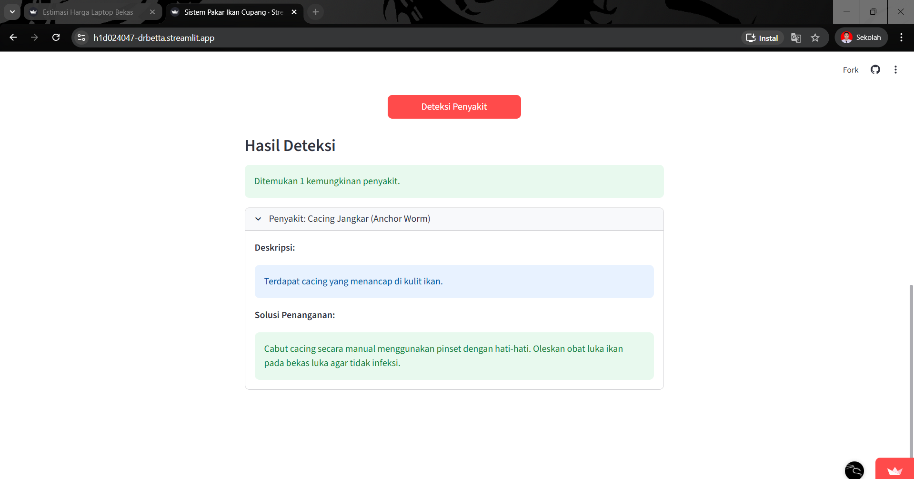
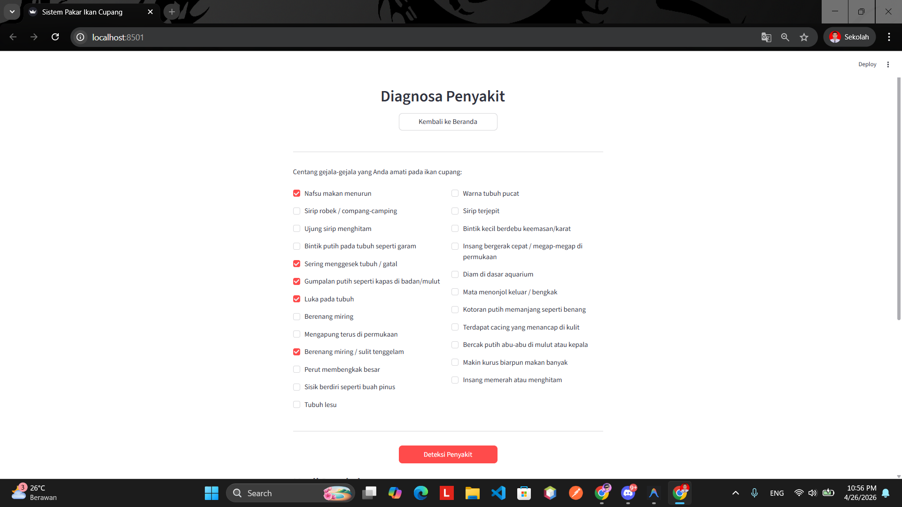
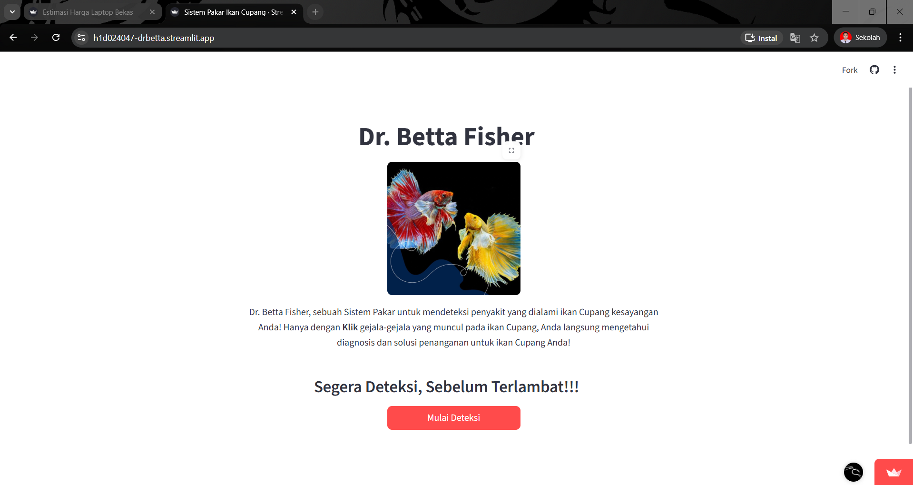

# Responsi 1 Praktikum Kecerdasan Buatan - Sistem Pakar

Nama: Faqih Ardiansyah
NIM: H1D024047
Shift Lama: A
Shift Baru: B

## Deskripsi Project
Mr. Betta Fisher adalah sebuah Sistem Pakar yang dibangun menggunakan Python dan Streamlit. Sistem ini dirancang untuk mendiagonsa penyakit yang dialami ikan Cupang berdasarkan gejala yang muncul pada tubuh ikan dan solusi untuk penanganannya.

## Screenshot




## Cara Menjalankan Project (Lokal)

1. Clone repositori ini:
   ```bash
   git clone https://github.com/faqihardi/H1D024047-PraktikumKB-Responsi1-Pakar.git dr_betta
   ```
2. Masuk ke direktori project:
   ```bash
   cd dr_betta
   ```
3. Install semua dependencies yang dibutuhkan:
   ```bash
   pip install -r requirements.txt
   ```
4. Jalankan aplikasi menggunakan Streamlit:
   ```bash
   streamlit run app.py
   ```

## Akses Aplikasi
Aplikasi ini juga telah di-deploy dan dapat diakses secara langsung melalui link berikut:
[https://h1d024047-drbetta.streamlit.app/]
